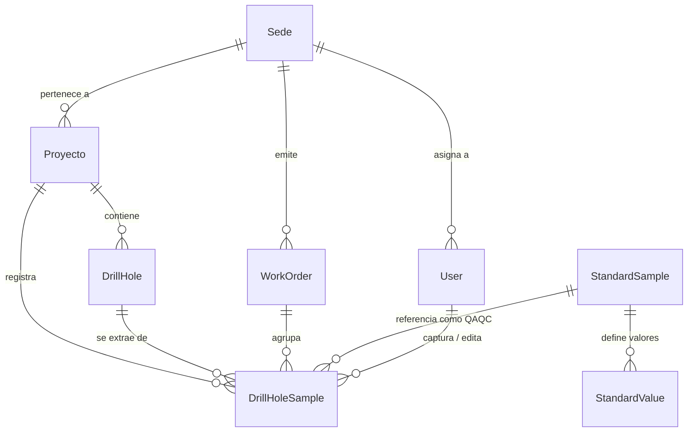

# Coreflow - Base de Conocimiento y Especificaciones del Sistema

> **Estado**: Documento Vivo / Fuente de Verdad  
> **Última Actualización**: 2026-08-07  
> **Propósito**: Servir como base de conocimiento integral para la arquitectura, módulos, reglas de negocio y especificidades técnicas de **Coreflow**. Este documento debe ser **actualizado obligatoriamente** ante cualquier cambio funcional o refactorización relevante en el sistema.

---

## 1. Visión General del Proyecto

**Coreflow** es una plataforma integral de gestión operacional y geológica orientada al sector minero y de exploración. El sistema optimiza y controla la cadena de custodia de perforación y muestreo, desde la captura acelerada en campo/núcleo hasta el despacho de muestras a laboratorios certificados (como ALS Laboratory), incluyendo un riguroso control de calidad (QA/QC) e integridad de datos.

El sistema funciona mediante una arquitectura de panel administrativo TALL stack (Tailwind, Alpine, Laravel, Livewire) basada exclusivamente en **Filament v5**.

---

## 2. Stack Tecnológico y Dependencias Clave

### Backend
- **PHP**: ^8.2 (Estricto tipado PHP 8.1+ y compatibilidad con tipos de Filament v5)
- **Framework**: Laravel ^12.0
- **Admin Panel / UI**: Filament ^5.0
- **Reactividad Frontend**: Livewire v4 (requerido por Filament v5) y Alpine.js
- **ORM / Base de Datos**: Eloquent ORM sobre MySQL/MariaDB

### Frontend & Styling
- **CSS Framework**: TailwindCSS ^4.0.0
- **Bundler**: Vite ^7.0.7

### Paquetes Especializados
- **Seguridad & Permisos**: `bezhansalleh/filament-shield` (RBAC nativo para Filament)
- **Auditoría & Trazabilidad**: `spatie/laravel-activitylog` & `pxlrbt/filament-activity-log`
- **Manipulación e Integración de PDFs**: `barryvdh/laravel-dompdf`, `setasign/fpdf`, `setasign/fpdi`
- **Generación de QR**: `simplesoftwareio/simple-qrcode`
- **Integración API Externa (PDF.co)**: HTTP Client de Laravel para consumo de API REST de PDF.co (`PDF_CO_API_KEY`) y llenado automático de plantillas AcroForm oficial de ALS.

---

## 3. Modelo de Datos y Entidades Principales

### Entidades Eloquent (`app/Models/`)

1. **`Sede`** (`app/Models/Sede.php`): Representa la unidad operativa o campus regional (ej. Minera Media Luna).
2. **`Proyecto`** (`app/Models/Proyecto.php`): Proyectos de exploración o explotación vinculados a una `Sede`.
3. **`User`** (`app/Models/User.php`): Usuarios del sistema con roles y permisos administrados vía Filament Shield. Pertenecen a una `Sede`.
4. **`DrillHole`** (Barreno / Sondaje) (`app/Models/DrillHole.php`):
   - Almacena datos espaciales (planeados e instalados) y técnicos de la perforación.
   - **Atributos Planeados** (opcionales): `planned_easting`, `planned_northing`, `planned_elevation`, `planned_dip`, `planned_azimuth`.
   - **Atributos Instalados / Medidos**: `easting`, `northing`, `elevation`, `dip`, `azimuth` (deshabilitados manualmente salvo presencia de informe PDF).
   - **Metadatos de Reporte**: `survey_pdf_path` (documento PDF), `planilla`, `survey_responsible`, `survey_date`.
   - **Especificaciones Técnicas**: `max_depth`, `drilling_type`, `core_size`, `purpose`.
   - **Métodos Helper**: `hasInstalledAttributes(): bool`, `hasSurveyPdf(): bool`.
5. **`DrillHoleSample`** (Muestra) (`app/Models/DrillHoleSample.php`):
   - Núcleo del sistema. Representa una muestra individual o muestra de control QA/QC.
   - Campos clave: `sample_number`, `sample_type` (O=Original, C=Composite, CONTROL), `control_type` (Estándar, Blanco, Duplicado), `from_depth`, `to_depth`, `length`, `sample_length` (recuperación), `weight`, `sampled_at`, `status` (`draft`, `pending`, `official`), `is_archived`, `errors` (JSON con errores de validación de importación).
6. **`StandardSample`** (Estándar QA/QC) (`app/Models/StandardSample.php`): Registro de materiales de referencia certificados (MRC/CRM) utilizados en controles de calidad. Almacena certificado de análisis.
7. **`StandardValue`** (`app/Models/StandardValue.php`): Valores esperados y tolerancias (desviación estándar) por elemento en cada estándar QA/QC.
8. **`WorkOrder`** (Orden de Trabajo / Despacho) (`app/Models/WorkOrder.php`): Agrupador logístico de muestras destinadas al laboratorio. Campos: `work_order_code`, `samples_quantity`, `status`, `sede_id`.
9. **`Element`** (`app/Models/Element.php`): Elementos químicos analizados (ej. Au, Ag, Cu, Pb, Zn).
10. **`AssayMethod`** (`app/Models/AssayMethod.php`): Métodos de ensaye y preparación analítica del laboratorio.

---

## 4. Módulos del Sistema y Funcionalidades

Los módulos se organizan dentro del panel de Filament en los siguientes grupos de navegación:

### 4.1. Administración & Configuración Base

- **Sedes** (`app/Filament/Resources/Sedes/SedeResource.php`):
  - CRUD de sedes operativas.
- **Proyectos** (`app/Filament/Resources/Proyectos/ProyectoResource.php`):
  - Asociación de proyectos con sus sedes.
- **Usuarios & Permisos** (`app/Filament/Resources/Users/UserResource.php`):
  - Administración de usuarios y asignación de roles/permisos integrados con `filament-shield`.

### 4.2. Perforación e Inventario

- **Barrenos (Drill Holes)** (`app/Filament/Resources/DrillHoles/DrillHoleResource.php`):
  - Registro de pozos/sondajes con diferenciación entre **Atributos Planeados** y **Atributos Instalados (Medidos)**.
  - **Carga y Extracción de PDF**: `FileUpload` para almacenar el informe de levantamiento (`survey_pdf_path`). Al cargar el documento, el servicio `DrillHolePdfParserService` extrae y auto-completa los datos de atributos instalados, planeados, planilla y responsable.
  - **Bloqueo Inteligente UX**: Los campos de atributos instalados se mantienen bloqueados (`disabled`) si no existe un informe PDF adjunto.
  - **Sistema de Alertas en Tabla**: Columna Badge `installed_status` que alerta mediante indicadores de color:
    - 🟢 `Instalados` (Verde con icono de check cuando los atributos y el PDF están presentes).
    - 🟡 `Sin PDF Adjunto` (Amarillo cuando los atributos existen pero falta el informe PDF).
    - 🔴 `Falta Capturar` (Rojo cuando faltan los atributos instalados).

### 4.3. Muestreo y Captura de Datos

- **Captura Ágil (Página Personalizada)** (`app/Filament/Pages/AgileCapture.php`):
  - **Propósito**: Módulo de alta velocidad diseñado para captura rápida en campo o mesa de logueo usando Alpine.js y Livewire.
  - **Características**:
    - Selección rápida de barreno con autocompletado y verificación de existencia.
    - **Fecha Automática**: Se eliminó la captura manual de fecha en el Grid; la fecha de muestreo (`sampled_at`) se establece automáticamente con la fecha del sistema (`now()`).
    - Incremento automático secuencial del número de muestra (`sample_number`).
    - Cálculo dinámico e instantáneo de intervalos (`from_depth`, `to_depth`, `length`).
    - Inserción rápida de muestras de control QA/QC (Estándar, Blanco, Duplicado).
    - Pre-validación en caliente en el navegador para prevenir traslapes e inconsistencias antes del guardado.
    - **Asignación Flexible de Core Size**: Botón de cabecera siempre visible que despliega todo el catálogo de tamaños de núcleo (`BQ`, `NQ`, `NQ2`, `HQ`, `HQ3`, `PQ`, `N/A`) para aplicar por **Rango (Muestra Inicio X a Muestra Fin Y)**, **Muestra Única** o **Todas las Muestras** del barreno.

- **Validación de CSV / Muestras** (`app/Filament/Resources/DrillHoleSampleResource.php`):
  - **Propósito**: Gestión integral de muestras e importación masiva vía hojas de cálculo (CSV/Excel) estructurada en un flujo de **dos niveles**:
    1. **Bandeja de Barrenos en Borrador (Landing Page)** (`Pages/ListDraftDrillHoles.php`):
       - **Gobernanza de Roles**:
         - *Geólogos / Capturistas*: Visualizan y gestionan los barrenos que ellos mismos han subido dentro de su Distrito Minero (`sede_id`).
         - *Supervisores Coreshack*: Visualizan y supervisan **todos** los barrenos en borrador de su Distrito Minero (`sede_id`), conociendo qué geólogo los cargó.
         - *Admin Coreshack / Super Admin*: Visualizan todos los distritos mineros con filtros rápidos por Distrito (`sede_id`) y Proyecto.
       - **Validación de Tenancy al Importar**: El modal `Importar CSV` valida estrictamente que los barrenos pertenezcan al distrito minero (`sede_id`) del usuario autenticado (salvo roles de administración global).
       - **Indicadores de Calidad en Bandeja**: Badges automáticos que muestran cantidad de muestras, errores pendientes (`X con Errores`), advertencias de datos faltantes (`Falta WO / Core Size`) y disponibilidad para acreditar (`Listo para Oficializar`).
       - **Acciones Rápidas**: Carga de CSV, navegación a *Revisar Muestras*, *Oficializar Barreno* directo (si no tiene errores) y *Descartar Borrador*.
       - **Layout & Widgets**: Utiliza `Width::Full` y el widget de cabecera `DrillHoleSampleStats` consolidando el total de muestras en borrador, errores, originales y controles.
    2. **Mesa de Trabajo por Barreno** (`Pages/ReviewDrillHoleSamples.php`):
       - Mesa de trabajo contextual acotada estrictamente al barreno seleccionado (`/{record}/review`) con ancho completo (`Width::Full`).
       - **Estructura Visual**: Ficha informativa del barreno con botón "Volver a la Bandeja" en la parte superior, seguida por los widgets estadísticos contextuales (`DrillHoleSampleStats`) inmediatamente arriba de la tabla.
       - **Edición en Slide-Over**: La edición de muestras se realiza mediante un modal lateral deslizante (*slide-over*) para máxima fluidez y rapidez.
       - **Tipos de Muestra Permitidos (`sample_type`)**: Estrictamente 2 tipos:
         - `O`: Para muestras Originales.
         - `Control`: Para muestras de control de QA/QC. (*No se admite ningún tipo Composite*).
       - **Tipos de Control QA/QC (`control_type`)**:
         - **Blanco**: Mostrado y almacenado como `Blank-ML`.
         - **Estándar**: Mostrado como el nombre exacto del estándar verificado en el catálogo de base de datos (`StandardSample`).
         - **Duplicado**: Mostrado en la tabla con la nomenclatura `DUP-(No. de Muestra Referenciada)` (ej: `DUP-ML100001`).
         - **Originales**: Muestran `—` en la columna de control.
       - **Tamaños de Núcleo Permitidos (`core_size`)**:
         - Catálogo restringido estrictamente a: `PQ`, `HQ`, `NQ` y `BQ`.
       - **Códigos de Work Order (`work_order_code`)**:
         - Restringidos y validados estrictamente a **6 dígitos numéricos** (`digits:6`), ej. `260801`.
       - **Filtros de Tabla (`tipo_registro`)**: Selector de filtrado para segmentar instantáneamente los registros de la mesa de revisión:
         - **`Gaps`**: Muestras que presentan advertencias o tramos de no-muestreo / GAP sin validar.
         - **`Registro con errores`**: Muestras con observaciones o errores de validación pendientes por subsanar.
         - **`Registros de Originales`**: Exclusivamente muestras originales de perforación (`O`).
         - **`Estandards`**: Muestras de control de estándares analíticos.
         - **`Blancos`**: Muestras de control de blanco (`Blank-ML`).
         - **`Duplicados`**: Muestras de control de duplicados de campo (`DUP-...`).
       - Acciones masivas de cabecera: *Asignar Core Size* (a todo el barreno o rango), *Asignar Work Order* (filtrada a la sede del barreno), *Validar Datos* y *Acreditar / Oficializar Barreno*.
       - Edición en caliente y eliminación individual con revalidación automática inmediata.
  - **Desvinculación de Precarga**: El `core_size` no se auto-asigna del barreno al importar por CSV (inicia en `null` hasta asignarse).
  - **Ciclo de vida de la muestra**:
    - `draft`: Estado inicial importado o en borrador con errores pendientes de corregir.
    - `official`: Muestra validada y aprobada para procesamiento.
    - `is_archived`: Muestras marcadas como históricas o anuladas.
  - **Importación Masiva & Servicio de Validación** (`app/Services/SampleValidationService.php`):
    - Ejecuta un motor de validación transaccional sobre muestras en borrador por usuario (`validateDraftsForUser`) o por barreno (`validateDraftsForBarreno`), detectando traslapes, GAPs, consistencia, pesos y conflictos cruzados de folio entre borradores activos (`Regla h`), persistiendo los errores en la columna `errors` (array JSON).

### 4.4. Calidad y Control (QA/QC)

- **Estándares QA/QC** (`app/Filament/Resources/StandardSamples/StandardSampleResource.php`):
  - Catálogo de muestras estándar con sus certificados de laboratorio y valores de concentración por elemento (`StandardValue`).
- **Elementos de Ensaye** (`app/Filament/Resources/Elements/ElementResource.php`):
  - Catálogo de elementos químicos.
- **Métodos de Ensaye** (`app/Filament/Resources/AssayMethods/AssayMethodResource.php`):
  - Catálogo de técnicas analíticas (ej. ICP-AES, Ensayos a Fuego).

### 4.5. Control de Muestreo & Logística (Despachos y Laboratorio)

- **Órdenes de Trabajo (Work Orders)** (`app/Filament/Resources/WorkOrders/WorkOrderResource.php`):
  - Creación y gestión de lotes de despacho de muestras.
  - Generación del código de Work Order y seguimiento de estado.
- **Monitor de Muestreo** (`app/Filament/Resources/SamplingMonitor/SamplingMonitorResource.php`):
  - Vista operativa en tabla (sin vista independiente de edición/creación) para la supervisión logística en tiempo real.
  - Permite verificar el supervisor responsable, fechas de envío, prioridad (*Rush*) y activar la generación del PDF oficial.

---

## 5. Integración Especializada: Generación de Formularios ALS PDF (`AlsFormFillService`)

Uno de los flujos críticos del sistema es el servicio `App\Services\AlsFormFillService`, responsable de la generación de la hoja de despacho oficial para el laboratorio ALS.

### Mecanismo de Funcionamiento:
1. **Recopilación de Muestras**: Carga las muestras asociadas a la `WorkOrder` ordenadas por código.
2. **Agrupación en Rangos Correlativos Únicos** (`buildRangeGroups`):
   - Agrupa las muestras **exclusivamente por secuencia numérica consecutiva** (sin separar ni diferenciar por tipo de muestra ni controles QA/QC).
   - Si se presenta una interrupción en la secuencia numérica, se cierra el grupo actual (`Start#`, `Finish#`, `QTY`) y se inicia una nueva fila con el siguiente rango correlativo.
   - La columna de tipo (`Type #n`) se mantiene **vacía / sin tipo** para no revelar muestras de control al laboratorio.
3. **Restricción de Plantilla**:
   - Limita a un máximo de **7 filas de grupos** por formulario según la especificación del formato oficial ALS.
4. **Integración vía API (PDF.co)**:
   - Envía el payload de campos de AcroForm mediante HTTP POST a `https://api.pdf.co/v1/pdf/edit/add`.
   - Rellena campos de cabecera (`Company name`, `Submitted by`, `Project ID`, `Dispatch#`, `Workorder#`, `PO#`, `Date`, `MUESTRAS`, `Rush`). El campo `PO#` se mapea con el mismo valor del `Dispatch#` / `WorkOrder`.
   - Aplica opción `flatten => true` para entregar un PDF plano e inalterable.
   - Retorna la respuesta como un `StreamedResponse` ejecutable desde las acciones de Filament/Livewire.

---

## 5.2. Generación del Registro de Costales en Excel (`SackFormGeneratorService`)

Servicio encargado de generar la hoja oficial en Excel (`.xlsx`) de **Registro de Costales** para despachos enviados al laboratorio Bureau Veritas, basado en la plantilla `formatoCostalTemplate.xlsx`.

### Mecanismo de Funcionamiento:
1. **Configuración Global de Peso Máximo**:
   - Definido en `config/coreflow.php` (`'max_sack_weight' => 25.0` kg estricto).
   - Agrupa iterativamente las muestras hasta un acumulado estricto de 25.0 kg por costal (`COSTAL 1`, `COSTAL 2`, etc.) utilizando la columna `weight`. Si agregar la siguiente muestra sobrepasa los 25.0 kg, se cierra el costal actual y la muestra inicia el siguiente costal.
2. **Encabezados Generales Mapeados**:
   - `Work Order`: Celda `E2` (`$workOrder->work_order_code`)
   - `Tipo de Muestra`: `B7` (`Drill Core`)
   - `Cantidad de Muestras`: `B8` (`$totalSamples`)
   - `Cantidad de Sacos`: `B9` (`$totalSacks`)
   - `Laboratorio`: `B10` (`Bureau Veritas`)
   - `Fecha de Envío`: `B11` (`now()->format('d/m/Y')`)
   - `Proyecto`: `E7` (`Media Luna`)
   - `Enviado desde`: `E8` (`San Miguel`)
   - `Geólogo`: `E9` (Nombre del usuario autenticado o supervisor)
   - `Vehículo` y `Conductor`: `E10` y `E11` (en blanco).
3. **Disposición Dinámica Adaptativa y Estilos Visuales**:
   - Muestra por muestra (sin agrupar en rangos), asignando 1 muestra por celda consecutiva.
   - **Paleta de Colores Exigida**:
     - Encabezado del costal (`COSTAL 1`, `COSTAL 2`...): Fondo de celda **`#2E5C8A`**, texto blanco en negrita y centrado (altura **22pt**).
     - Celdas de Muestras (`ML157100`, `ML157101`...): Fondo de celda **`#F2F2F2`**, texto oscuro centrado con bordes delgados (altura **20pt**).
   - **Fijación de Altura de Filas**: Se define explícitamente `setRowHeight(20)` para cada fila de datos insertada/rellenada, evitando que hereden los 4.05pt de las filas espaciadoras del template original.
   - **Limpieza de filas sobrantes**: Elimina programáticamente las filas estáticas vacías sobrantes (`removeRow(19, 30)`), evitando tablas en blanco al final cuando hay pocos costales.
   - **Cálculo dinámico de filas por bloque**: Evalúa el número máximo de muestras en cada bloque de 5 costales. Si un costal requiere más de 4 muestras, inserta automáticamente filas adicionales adaptativas sin sobreponer jamás las cabeceras del siguiente bloque.
   - **Clonación dinámica de bloques**: Si el despacho supera 5 costales (`COSTAL 6`, `COSTAL 7`...), inserta dinámicamente nuevos bloques de 5 costales aplicando la paleta de colores y estilos.
4. **Descarga Directa**:
   - Expone la descarga `.xlsx` mediante `StreamedResponse` ejecutable desde las acciones de Filament en `SamplingMonitorTable` y `WorkOrdersTable`.

---

## 5.3. Módulo Filament Page `Samples Settings` (`App\Filament\Pages\SamplesSettings`)

Página de configuración administrativa en Filament (`Configuración -> Configuración de Muestras`) para la gestión dinámica de parámetros globales de pesaje y empaquetado.

### Parámetros Configurables:
- **`max_sack_weight`**: Límite acumulativo de peso por costal/saco para despachos (en kg, por defecto `25.00` kg).
- **`min_sample_weight`**: Peso mínimo permitido por muestra individual (en kg, por defecto `0.50` kg).
- **`max_sample_weight`**: Peso máximo permitido por muestra individual (en kg, por defecto `15.00` kg).

### Integración y Persistencia:
- **Navegación en Sidebar**: Ubicado en el grupo **Configuración** (`Configuración de Muestras`), icono `'heroicon-o-adjustments-horizontal'` con acceso restringido vía `canAccess()` a `super_admin`, `Admin CoreFlow` y `Supervisor CoreS`.
- **Modelo Singleton (`SampleSetting`)**: Almacenado en la tabla `sample_settings` y consultado dinámicamente mediante `SampleSetting::getSettings()`.
- **Auditoría de Cambios**: Registro de modificaciones vía `spatie/laravel-activitylog`.

---

## 5.4. Gobernanza de Roles y Matriz de Acceso por Módulo

El sistema implementa control de acceso basado en roles (RBAC) mediante `spatie/laravel-permission` y `bezhansalleh/filament-shield`, complementado con comprobaciones de autorización `canViewAny()` / `canAccess()` y scoping de *multi-tenancy* por distrito minero (`sede_id`):

| Módulo | Recurso / Página | `super_admin` | `Admin CoreFlow` | `Supervisor CoreS` | `Geologo` |
| :--- | :--- | :---: | :---: | :---: | :---: |
| **Validación de CSV** | `DrillHoleSampleResource` | ✅ Todos los Distritos | ✅ Todos los Distritos | ✅ Barrenos de su Distrito | ⚠️ Solo sus barrenos cargados |
| **Captura Ágil** | `AgileCapture` | ✅ Total | ✅ Total | ✅ Total | ✅ Total |
| **Monitor de Muestreo** | `SamplingMonitorResource` | ✅ Total | ✅ Total | ✅ Gestión y Envíos | ❌ Sin acceso |
| **Summary Samples** | `SummarySamplesResource` | ✅ Total | ✅ Total | ✅ Total | ❌ Sin acceso |
| **Drill Holes (Barrenos)** | `DrillHoleResource` | ✅ Total + Gaps | ✅ Total + Gaps | ✅ Consulta / Carga + Gaps | ✅ Consulta / Carga |
| **Work Orders** | `WorkOrderResource` | ✅ Total | ✅ Total | ✅ Total | ❌ Sin acceso |
| **Standard Samples** | `StandardSampleResource` | ✅ Total | ✅ Total | ✅ Total | ❌ Sin acceso |
| **Proyectos** | `ProyectoResource` | ✅ Total | ✅ Total | ❌ Sin acceso | ❌ Sin acceso |
| **Distritos (Sedes)** | `SedeResource` | ✅ Total | ✅ Total | ❌ Sin acceso | ❌ Sin acceso |
| **Catálogos (Elements/Assay)**| `ElementResource`, `AssayMethodResource` | ✅ Total | ✅ Total | ❌ Sin acceso | ❌ Sin acceso |
| **Usuarios** | `UserResource` | ✅ Total | ✅ Total | ❌ Sin acceso | ❌ Sin acceso |
| **Roles y Permisos** | `RoleResource` | ✅ Total | ✅ Total | ❌ Sin acceso | ❌ Sin acceso |
| **Configuración de Muestras** | `SamplesSettings` | ✅ Total | ✅ Total | ✅ Parámetros | ❌ Sin acceso |

---

## 6. Motor de Validaciones Técnicas (`SampleValidationService`)

El servicio `SampleValidationService` aplica las siguientes reglas de negocio obligatorias sobre las muestras importadas:

| Regla | Descripción |
| :--- | :--- |
| **a. Traslapes de Intervalo** | En muestras originales (`O`), $FROM_{actual} \ge TO_{anterior}$. De lo contrario, marca error de traslape. |
| **a. Advertencia GAP** | Si hay un hueco $(FROM_{actual} - TO_{anterior}) > 0.011\text{ m}$, genera advertencia de intervalo no muestreado. |
| **b. Consistencia TO - FROM** | $|(TO - FROM) - Longitud| \le 0.011\text{ m}$. |
| **Recuperación válida** | `sample_length` (recuperación de núcleo) no puede ser mayor que la longitud perforada `length`. |
| **c. Obligatoriedad en Originales** | Para muestras tipo `O`, `from_depth` y `to_depth` son strictly obligatorios y $FROM < TO$. |
| **d. Tipo de Control** | Para muestras tipo `CONTROL`, `control_type` no puede ser nulo. |
| **f. Peso Dinámico (Weight)** | El peso debe estar dentro del rango configurado `[min_sample_weight, max_sample_weight]` en `Samples Settings`. |
| **g. Unicidad en Lote** | El `sample_number` no debe repetirse dentro de la misma importación. |
| **h. Unicidad en Proyecto** | El `sample_number` no puede existir previamente en muestras oficiales (`official`) del mismo proyecto ni en otros borradores activos (`draft`) del mismo proyecto. |

---

## 7. Protocolo Obligatorio de Mantenimiento de esta Base de Conocimiento

> [!CAUTION]
> **REGLA DE ORO**: Este archivo debe ser modificado y sincronizado inmediatamente cada vez que se realice un cambio relevante en el código.

### Checklist de Actualización para Desarrolladores / Agentes AI:

1. **Creación o Modificación de Modelos**:
   - Registrar la nueva entidad en la Sección 3 (Modelo de Datos) con sus relaciones clave.
2. **Creación o Modificación de Recursos Filament**:
   - Documentar la nueva pantalla, grupo de navegación y permisos asociados en la Sección 4.
3. **Cambios en Reglas de Validación o Servicios**:
   - Actualizar las especificaciones en la Sección 6 (`SampleValidationService`) o Sección 5 (`AlsFormFillService`).
4. **Integración con Servicios Externos**:
   - Documentar cualquier nuevo endpoint, API Key requerida o cambios en los contratos de servicio en la Sección 2 y 5.

---
*Fin de la Base de Conocimiento de Coreflow.*
